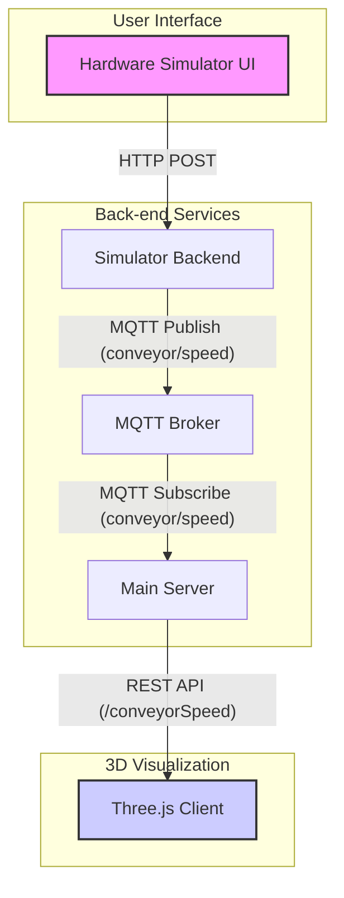

# ซอร์สโค้ดนี้ ใช้สำหรับเป็นตัวอย่างเท่านั้น ถ้านำไปใช้งานจริง ผู้ใช้ต้องจัดการเรื่องความปลอดภัย และ ประสิทธิภาพด้วยตัวเอง

# ConveyorWatch: 3D Conveyor Belt Simulator

ConveyorWatch is a real-time 3D simulation of a factory conveyor belt system. It features a hardware control panel simulator to adjust the conveyor's speed, a backend server to process the speed data, and a 3D visualization built with Three.js.


*Fig 1: 3D simulation with products moving at 60 pcs/min.*


*Fig 2: Hardware simulator UI for controlling the conveyor speed.*

## Architecture

The project is composed of three main components that communicate via HTTP and MQTT:

1.  **Hardware Simulator**: A web-based UI that mimics a physical control panel. Users can set the conveyor speed, which is sent to the simulator's backend.
2.  **Server**: A Node.js server that subscribes to speed updates from the Hardware Simulator via an MQTT broker. It then exposes this data through a REST API.
3.  **3D Visualization**: A Three.js application that fetches the speed data from the server and dynamically updates the animation of products on the conveyor belt.



## Features

-   **Real-time Speed Control**: Adjust the conveyor speed from 0 to 60 products per minute using a slider or buttons.
-   **Dynamic 3D Visualization**: The number of products (cubes) spawned on the conveyor and their speed matches the setting from the hardware simulator.
-   **Decoupled Architecture**: Components are decoupled using an MQTT broker, allowing for independent operation and scalability.
-   **Interactive 3D Scene**: Orbit controls allow users to pan, zoom, and rotate the camera to view the conveyor from any angle.

## Technology Stack

-   **3D Visualization**: [Three.js](https://threejs.org/), [Vite](https://vitejs.dev/)
-   **Hardware Simulator**: HTML, [Tailwind CSS](https://tailwindcss.com/), Vanilla JavaScript
-   **Backend**: [Node.js](https://nodejs.org/), [Express.js](https://expressjs.com/)
-   **Messaging**: [MQTT](http://mqtt.org/) (requires an MQTT broker like [Mosquitto](https://mosquitto.org/))

## Prerequisites

Before you begin, ensure you have the following installed:
-   [Node.js](https://nodejs.org/en/download/) (which includes npm)
-   An MQTT broker running on `localhost:1883`. The recommended broker is [Eclipse Mosquitto](https://mosquitto.org/download/).

## Installation

1.  **Clone the repository:**
    ```bash
    git clone <repository-url>
    cd <repository-name>
    ```

2.  **Install dependencies for each component:**
    Navigate into each directory and run `npm install`.
    ```bash
    # Install server dependencies
    cd server
    npm install
    cd ..

    # Install hardware simulator dependencies
    cd hardware-simulator
    npm install
    cd ..

    # Install 3D visualization dependencies
    cd threejs-vite-template-1
    npm install
    cd ..
    ```

## Running the Simulation

To run the full simulation, you need to start the MQTT broker and all three application components in separate terminal windows.

1.  **Start your MQTT Broker:**
    If you are using Mosquitto, you can typically run it with:
    ```bash
    mosquitto -v
    ```

2.  **Start the Main Server:**
    This server listens for MQTT messages and serves speed data to the 3D client.
    ```bash
    node server/index.js
    ```
    *Expected output: `Server running on port 3000` and `Connected to MQTT broker`*

3.  **Start the Hardware Simulator Backend:**
    This server receives HTTP requests from the simulator UI and publishes to MQTT.
    ```bash
    node hardware-simulator/index.js
    ```
    *Expected output: `Hardware simulator web server listening at http://localhost:3001`*

4.  **Start the 3D Visualization Client:**
    This command starts the Vite development server for the Three.js application.
    ```bash
    cd threejs-vite-template-1
    npm run dev
    ```
    *Expected output: Vite will provide a local URL, typically `http://localhost:5173/`*

5.  **Interact with the Application:**
    -   Open the **Hardware Simulator** in your browser by navigating to `hardware-simulator/index.html`.
    -   Open the **3D Visualization** by navigating to the URL provided by Vite (e.g., `http://localhost:5173`).

    You can now use the simulator UI to control the speed of the products in the 3D scene.

## Project Structure

```
ConveyorWatch/
├── hardware-simulator/ # UI and backend for the speed controller
│   ├── index.html      # Frontend UI
│   └── index.js        # Backend server (Express + MQTT)
├── server/             # Main backend server
│   └── index.js        # Subscribes to MQTT, serves data via REST
├── threejs-vite-template-1/ # 3D visualization client
│   ├── main.js         # Core Three.js application logic
│   └── index.html      # Entry point for the 3D app
└── README.md           # This file
```
